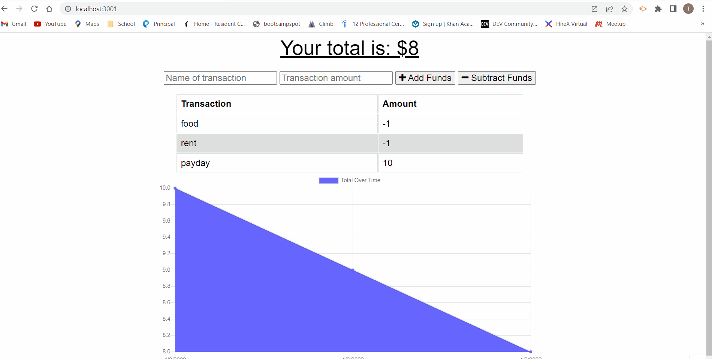

# Budget Tracker PWA

 

## **Link** to GitHub repo: https://github.com/alinz07/budget-tracker-mod19

## **Link** to app deployed to Heroku: https://budget-tracker-mod19-tlinz.herokuapp.com/

 

## **Motivation and Code Overview**

Update an existing budget tracker application to allow for offline access and functionality. The Budget Tracker PWA has a very simple data structure that modularizes the models from the html and css assets in the public folder, a folder for the api routes to update the db once the user has internet connectivity and a server.js file at the root to run the application on the local server. To download and use the app, any user need only visit the deployed app on Heroku and download to their local machine.

 

## **Table of Contents**

[How and Why?](#what-problem-does-this-solve-and-how-was-a-solution-accomplished)  
[Things I learned](#things-i-learned)  
[What makes this project stand out?](#what-makes-this-project-stand-out)  
[Challenge Criteria](#challenge-criteria) 
[Screenshot of Web Application](#screenshot-of-web-application) 
[Credits](#credits) 

 

## **What Problem does this solve and how was a solution accomplished?**

Having offline functionality is paramount to the success of an application that handles users’ financial information. The app will use mongoose and indexedDB from the previous module because to be a successful developer, you must be able to formulate a solution by synthesizing knowledge that you’ve picked up from previous experience.

 

## **Things I learned**

-   I spent a lot of time reading the module's indexedDb walkthrough and better understand the query language and network manipulation in Dev Tools.
-   I also practiced patience with this app because I couldn't get the back end to work. It turns out I omitted the "I" in MONGODB_URI for the mongodb atlas key when connecting my data from heroku to atlas. A great lesson in going over every single step, chronologically, when setting up the remote server connection and reading heroku logs --tail.
-   I learned about chrome's ability to download PWAs and how to modify the downloaded app target to not use a chrome proxy, but rather chrome itself, so that the app looks like a standalone app and so I don't have to download a chrome_proxy app.

 

## **What makes this project stand out?**

-   This app is very useful to end users because of it's offline functionality that leverages service workers for caching the static files, the browser's indexedDb api for transactions, and a remote server hosted on MongoDB Atlas.

 

## **Challenge Criteria**

AS AN avid traveler
I WANT to be able to track my withdrawals and deposits with or without a data/internet connection
SO THAT my account balance is accurate when I am traveling

GIVEN a budget tracker without an internet connection 

-   WHEN the user inputs an expense or deposit 
    THEN they will receive a notification that they have added an expense or deposit

-   WHEN the user reestablishes an internet connection 
    THEN the deposits or expenses added while they were offline are added to their transaction history and their totals are updated

     

## **Screenshot of Web Application**

 

### **Credits**

The starter code for this application comes from the University of Wisconsin-Milwaukee Extended Campus
